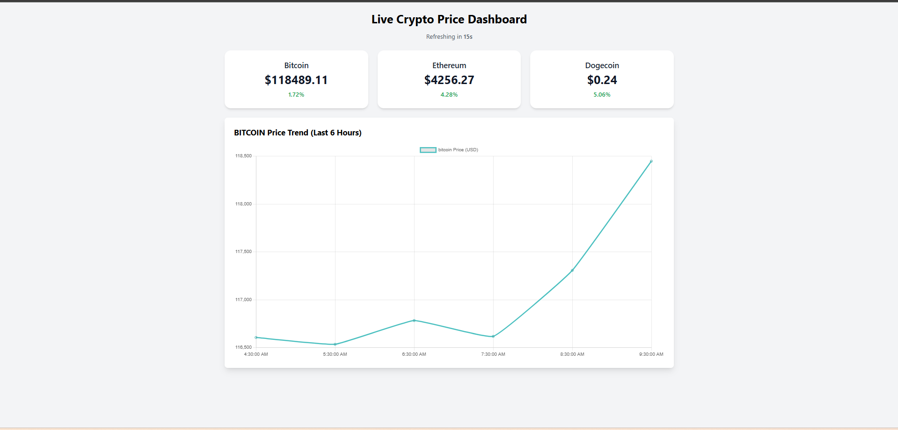

# Live Crypto Price Dashboard

A simple and responsive cryptocurrency dashboard built with React and TypeScript.  
Tracks Bitcoin, Ethereum, and Dogecoin prices in real time with an interactive chart and automatic updates every 30 seconds.

## Features
- Live price updates every 30 seconds
- Interactive price chart for the selected coin
- Click on a coin card to change the chart
- Responsive design for desktop and mobile
- Uses CoinCap API for data

## Preview

## Tech Stack
- React with Hooks
- TypeScript
- Axios
- Chart.js with react-chartjs-2
- Tailwind CSS
- Netlify for deployment

## Installation and Setup

1. Clone the repository:

2. Install dependencies:

3. Create a .env file in the root folder:
Get your free API key from https://coincap.io/

4. Start the development server:
npm install
npm start
Then open http://localhost:3000 in your browser.

## Deployment on Netlify
1. Push your code to GitHub
2. Connect the repository to Netlify
3. In Netlify environment variables, add:
4. Build command:
5. Publish directory:
6. Deploy
